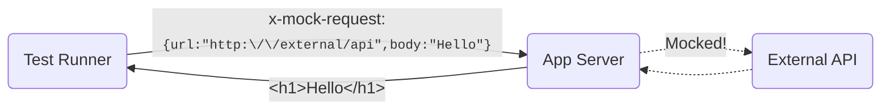

# Request Mocking Protocol (RMP)

A protocol for declarative mocking of HTTP requests.
Useful in E2E testing when you need to mock API calls made on the server (e.g., in React Server Components).

## Index

<!-- doc-gen TOC maxDepth="3" excludeText="Index" -->
- [How it works](#how-it-works)
- [Concepts](#concepts)
  - [Request Schema](#request-schema)
  - [Response Schema](#response-schema)
  - [Transport](#transport)
- [Installation](#installation)
- [Usage](#usage)
- [App Integration](#app-integration)
  - [Next.js](#nextjs)
  - [Astro](#astro)
- [Test-runners Integration](#test-runners-integration)
  - [Playwright](#playwright)
  - [Cypress](#cypress)
- [API](#api)
  - [Interceptors](#interceptors)
  - [MockClient](#mockclient)
- [License](#license)
<!-- end-doc-gen -->


## How it works



1. The mock defines a request and response in a serializable JSON format.
2. When opening a webpage, the mock is attached to the navigation request as a custom HTTP header.
3. On the server, an interceptor reads the mock header and applies mock to the outgoing API requests.
4. The application server renders the page using data from the mocked response.

## Concepts

### Request Schema

The request schema is a serializable object that defines parameters for matching a request.

Example:
```js
{
  method: 'GET', 
  url: 'https://jsonplaceholder.typicode.com/users',
  query: {
    foo: 'bar'
  }
}
```
This schema will match the request:
```
GET https://jsonplaceholder.typicode.com/users?foo=bar
```

[Full schema definition.](src/protocol/request-schema.ts)

### Response Schema

The response schema is a serializable object that defines how to build the mocked response.

Example:
```js
{
  status: 200,
  body: 'Hello world'
}
```

[Full schema definition.](src/protocol/response-schema.ts)

### Transport

Transport allows passing mock schemas from the test runner to the application server.
RMP uses a custom HTTP header `x-mock-request` for transferring a JSON-stringified schemas list.

Example:
```
x-mock-request: [{"reqSchema":{"method":"GET","patternType":"urlpattern","url":"https://example.com"},"resSchema":{"body":"hello","status":200}}]
```

On the server side, the interceptor will read the incoming headers and apply the mocks.

## Installation
```
npm i -D request-mocking-protocol
```

## Usage

To mock requests with RMP, you need to perform two actions:

1. Setup a request interceptor in the application.
2. Define mocks in your test using the `MockClient` class.

Check out the sections below for integration with varios frameworks and test-runners.

## App Integration

### Next.js

Add the following code to the [instrumentation.ts](https://nextjs.org/docs/app/building-your-application/optimizing/instrumentation) file:
```ts
import { headers } from 'next/headers';

export async function register() {
  if (process.env.NEXT_RUNTIME === 'nodejs' && process.env.NODE_ENV !== 'production') {
    const { setupFetchInterceptor } = await import('request-mocking-protocol/fetch');
    setupFetchInterceptor(() => headers());
  }
}
```

> Note that you need to dynamically import interceptor inside `process.env.NEXT_RUNTIME = 'nodejs'`. 

### Astro
See [astro.config.ts](examples/astro-cypress/astro.config.ts) in the astro-cypress example.

### Custom

You can write an interceptor for any other framework. It requires 2 steps:

1. Read the HTTP headers of the incoming request
2. Capture outgoing HTTP requests

Check-out the reference implementations in the [src/interceptors](src/interceptors) directory.

## Test-runners Integration

On the test runner side, you can define request mocks via the `MockClient` class.

### Playwright

Set up the `mockServerRequest` fixture:
```ts
import { test as base } from '@playwright/test';
import { MockClient } from 'request-mocking-protocol';

export const test = base.extend<{ mockServerRequest: MockClient }>({
  mockServerRequest: async ({ context }, use) => {
    const mockClient = new MockClient();
    mockClient.onChange = async (headers) => context.setExtraHTTPHeaders(headers);
    await use(mockClient);
  },
});
```
Use the `mockServerRequest` fixture to define server-side request mocks:
```ts
test('my test', async ({ page, mockServerRequest }) => {
  await mockServerRequest.GET('https://jsonplaceholder.typicode.com/users', {
    body: [{ id: 1, name: 'John Smith' }],
  });

  // ...
});
```

### Cypress

1. Add a custom command `mockServerRequest` in support files, see example [mock-server-request.js](examples/astro-cypress/cypress/support/mock-server-request.js).

2. Use the custom command to define mocks:
    ```js
    it('shows list of users', () => {
      cy.mockServerRequest('https://jsonplaceholder.typicode.com/users', {
        body: [{ id: 1, name: 'John Smith' }],
      });

      // ...
    });
    ```

## API

### Interceptors

Interceptors are used on the server side to capture HTTP requests and apply mocks.
Currently, there are two interceptors available.

#### Fetch

This interceptor hooks into `globalThis.fetch`.

Basic usage:
```ts
const { setupFetchInterceptor } = await import('request-mocking-protocol/fetch');

setupFetchInterceptor(() => { /* retrieve headers of the incoming HTTP request */ });
```
The actual function for retrieving incoming headers depends on the application framework. 

#### MSW

You can use [MSW](https://mswjs.io/docs/integrations/node) to intercept server-side requests:

```ts
import { setupServer } from 'msw/node';
import { createHandler } from 'request-mocking-protocol/msw';

const mockHandler = createHandler(() => { /* retrieve headers of the incoming HTTP request */ });
const mswServer = setupServer(mockHandler);
mswServer.listen();
```

The actual function for retrieving incoming headers depends on the application framework. 

### MockClient

The `MockClient` class is used on the test-runner side to define HTTP request mocks.

#### Constructor

##### `constructor(options?: MockClientOptions)`

Creates a new instance of `MockClient`.

- `options` (optional): An object containing configuration options.
  - `debug` (optional): A boolean indicating whether to enable debug mode.
  - `defaultMethod` (optional): The default HTTP method to use for requests.

#### Properties

##### `headers: Record<string, string>`

Returns HTTP headers that are built from the mock schemas. Can be sent to the server for mocking server-side requests.

##### `onChange?: (headers: Record<string, string>) => unknown`

A callback function that is called whenever the mocks are changed.

#### Methods

##### `async addMock(reqSchema, resSchema): Promise<void>`
##### `async GET(reqSchema, resSchema): Promise<void>`
##### `async POST(reqSchema, resSchema): Promise<void>`
##### `async PUT(reqSchema, resSchema): Promise<void>`
##### `async DELETE(reqSchema, resSchema): Promise<void>`
##### `async HEAD(reqSchema, resSchema): Promise<void>`
##### `async ALL(reqSchema, resSchema): Promise<void>`

Adds a new mock for the corresponding HTTP method.

- `reqSchema`: The request schema to add.
- `resSchema`: The response schema to add.

##### `async reset(): Promise<void>`

Clears all mock schemas and rebuilds the headers.

## License
[MIT](https://github.com/vitalets/request-mocking-protocol/blob/main/LICENSE)